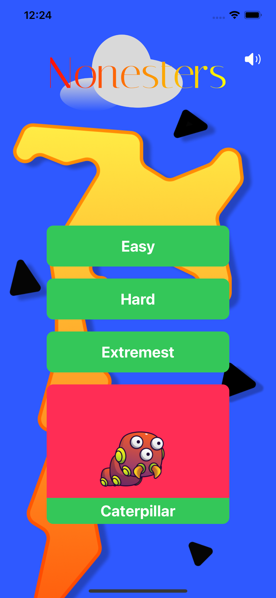
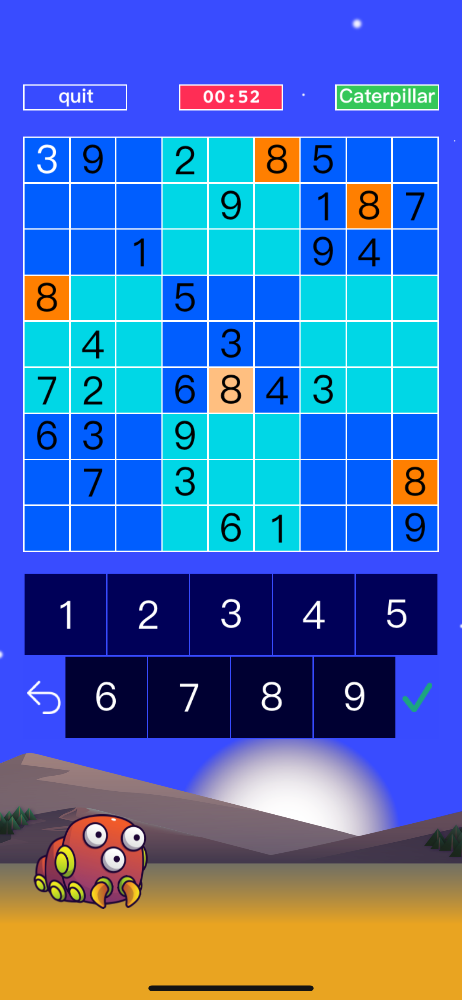

# Nonesters Sudoku

This is an iOS game where you have to solve Sudoku puzzles while you keep your avatar alive.

The name of the app is called Nonesters. You can select between three levels: easy, hard and
extremest, where each level gives you less time to complete the Sudoku puzzle. You can also choose
your favorite game character by swiping from right to left and from left to right. You can also
mute and unmute the sound.

The app starts at the `MenuViewController` where you choose your settings. The `MenuViewController`
invokes `GameViewController` where the main game logic is. `GameViewController` invokes the 
`ScoreViewController` which gives information on how you played. This  project is divided into three
folders: Datastructures, GlobalAccess and Sounds. The Datastructures folder contains the classes 
and data structures that are used in the project, such as the Sudoku class that represents the class
that can generate Sudoku puzzles and solutions. The GlobalAccess folder is where `MusicPlayer` 
class is, which is a Singleton class that allows the control of the sounds in the app. The Sounds 
folder contains the sounds used in the app.

## Rules to Contribute in the project:
* No changes should be committed directly to the master without approval. At least one person 
 has to approve each pull request before committing to the master.
* We will be using pull requests and code reviews.
* Let's be polite and respectful when writing code reviews.

